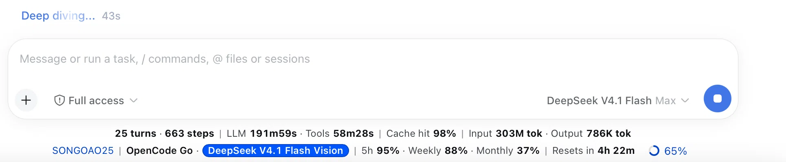
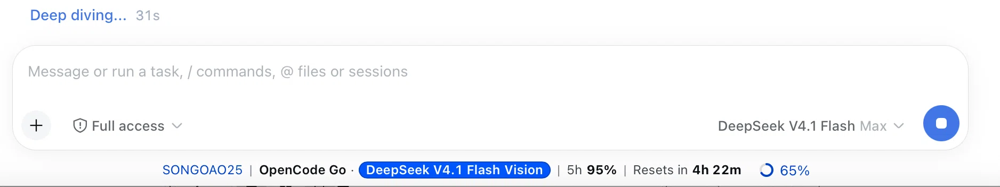
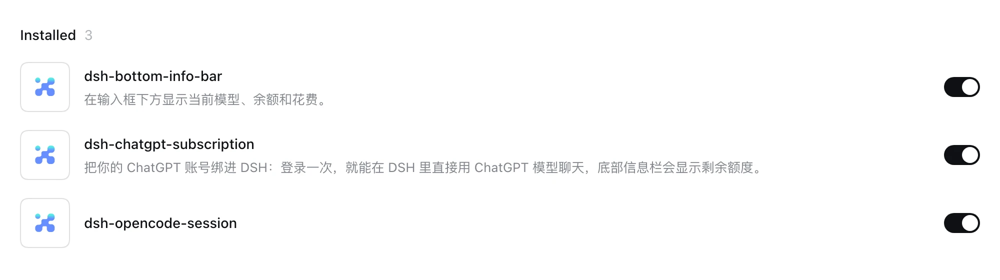
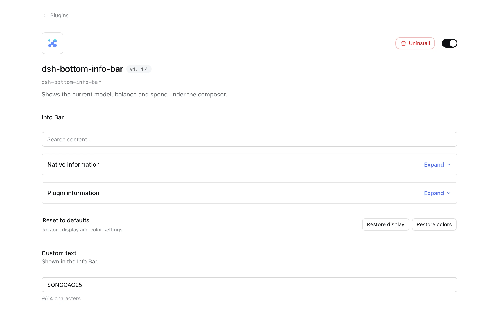
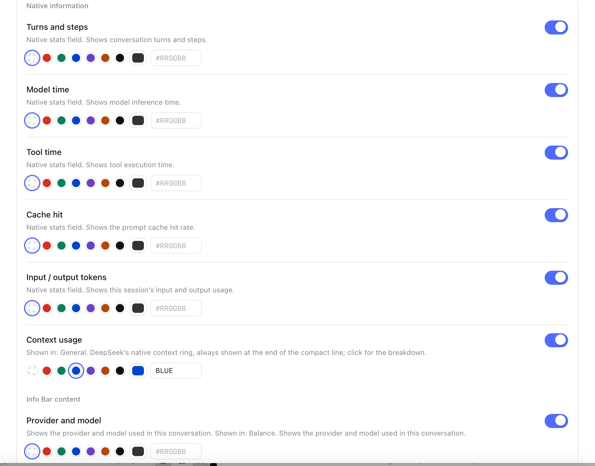
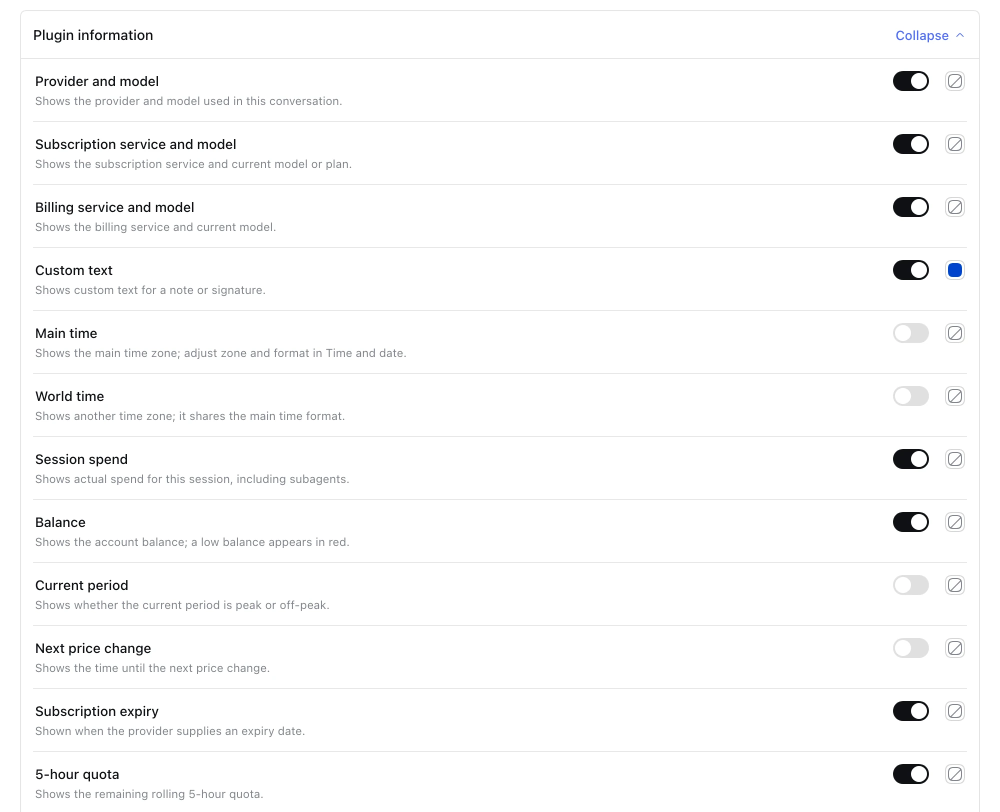

# Bottom Info Bar


**English** | [**中文**](README.zh-CN.md)

[](https://github.com/songoao25/dsh-bottom-info-bar/blob/main/LICENSE)
[](https://github.com/songoao25/dsh-bottom-info-bar/releases)
[](https://github.com/songoao25/dsh-bottom-info-bar)
[](https://github.com/songoao25/dsh-bottom-info-bar/actions)

**A drop-in replacement for the stats row under the DeepSeek Harness composer.** Everything that row showed stays — turns and steps, LLM and tool time, cache hit rate, input/output tokens — and it adds the **provider and exact model**, your **real balance** (or subscription quota, or this month's bill), **peak/off-peak pricing** with a countdown to the next switch, and **what this conversation has cost so far**.

Install once, restart once, done. The billing mode is detected automatically, and every figure comes from a provider API — or is **explicitly labelled as an estimate**.




<sub>**Full** and **compact** view (English UI; labels follow DSH's language setting). Click the bar to switch.</sub>

> 💬 Questions or ideas? Scan the QR code to join our WeChat group **DeepThinking**. <sub>The code expires about 7 days after it is generated — if it has expired, open an issue and we will refresh it.</sub>

## At a glance

- **Three billing modes, auto-detected** — balance, subscription quota, or cloud bill. They replace each other and never overlap.
- **Real data, honestly labelled** — balances, quotas, plans and bills come from official provider APIs. The one figure that cannot (OpenAI has no public balance API) is derived from your spending rate and marked `(estimated)` in the bar.
- **Exactly what DSH shows** — the provider and model match DSH's model switcher, and newly published models are picked up automatically.
- **Peak / off-peak pricing** — both prices plus a countdown to the next switch (weekends count as off-peak all day).
- **Honest spend tracking** — this conversation (including subagents), today, last 30 days, and all time — persisted to disk, nothing lost on restart.
- **Native by design** — it replaces the native row instead of duplicating it; click to switch full/compact, and pick fields and colours on the plugin page.

## Requirements

- **[DeepSeek Harness](https://github.com/deepseek-ai)** with the **web** interface (`dsh web`). This plugin is web-only — the bar is a web UI component.
- **[pnpm](https://pnpm.io/)** — used by `dsh plugin` to manage profile packages.
- An API key for whichever provider you use, set in DSH under **Settings → Models**.

## Quick start

```bash
dsh plugin --profile web add dsh-bottom-info-bar
```

Or add it from DSH itself: **Plugins → Add plugin**, then enter the package name `dsh-bottom-info-bar`. The repository address works there too — the package lives at the repository root.

Then **restart `dsh web`** — plugins are composed when the host process starts, so a page refresh is not enough.

That is the whole setup: configure your provider's API key, restart, done. The plugin then shows up under **Plugins**, enabled:



<details>
<summary>Other ways to install (and which one to pick)</summary>

**Recommended: the npm command above.** It installs the released artifact, and the update reminder hands you one command — see [Updating](#updating).

**From the GitHub address** — the package is at the repository root, so DSH takes the repository address directly (this is the address the plugin page's guide asks for):

```bash
dsh plugin --profile web add https://github.com/songoao25/dsh-bottom-info-bar
```

It tracks the default branch rather than a release. No build runs on install: `lib/` is committed. Update by running the same command again.

**From a local checkout** (for development, or to run unreleased code):

```bash
git clone https://github.com/songoao25/dsh-bottom-info-bar.git
dsh plugin --profile web add /path/to/dsh-bottom-info-bar
```

This creates a `link:` install. It tracks your checkout rather than npm, so updates are `git pull` instead of a package install — see [Updating](#updating).

If you installed from a checkout before the package moved to the repository root, the path ended in `/plugin`. That directory no longer exists — remove the plugin and run the command above again.

**One-command script** — clone and install in one step:

```bash
git clone https://github.com/songoao25/dsh-bottom-info-bar.git
cd dsh-bottom-info-bar
./install.sh                # installs into the "web" profile; --profile <name> to override
```

Like the local-checkout option, this produces a `link:` install.

Detailed instructions and troubleshooting: [docs/INSTALL.md](docs/INSTALL.md).
</details>

## Configuration

Everything is on the **plugin page** — **Plugins → bottom-info-bar** — not in DSH's global settings. Field switches, colours, custom text and the billing ledger all live there, and changes save as you make them.



<sub>**Info Bar** holds the search box, the two field groups, **Restore defaults** and **Custom text**; typing in the search box expands both groups. **Billing data** exports CSV/JSON or clears the ledger.</sub>



<sub>**Native information** — the six fields DSH's own stats row already showed. Each row keeps its own switch and colour; the defaults match DSH.</sub>



<sub>**Plugin information** — everything the bar adds: provider and model, subscriptions, spend, balance, peak/off-peak prices and quota. Switch a field off and the bar drops it.</sub>

## What it does not do

The boundaries are part of the design, and they are worth stating plainly:

- **It never passes a guess off as a fact.** Every figure comes from a provider API — or, in the one case where no API exists (OpenAI has no public balance endpoint), is computed from your spending rate and labelled `(estimated)` in the bar. When a number is simply unavailable, the bar says so instead of filling the gap.
- **It never updates itself.** The version reminder only tells you a newer version exists and prepares the command; nothing on your machine changes until you run it.
- **It never binds your ChatGPT account.** That belongs to the companion plugin [dsh-chatgpt-subscription](https://github.com/songoao25). This bar only reads the local token.
- **It never stores conversations.** The ledger records tokens, model, provider and cost — no prompts, no messages, no API keys.
- **It does not work outside the web interface.** There is no terminal or headless equivalent of the bar.

## Billing modes

The bar follows the active session in DSH and picks the display from the provider — no manual mode selection.

### Balance mode (DeepSeek, Kimi, OpenRouter, StepFun, Xiaomi MiMo, OpenAI reference)

Shows the **real balance** from the provider's `/user/balance` (or equivalent) API. It refetches the moment the bar opens, refreshes, or the provider changes, then polls every 60 seconds. The last known snapshot is kept on failure so the row never goes blank.

When the balance drops below ¥20, the amount and a `Low` label turn red.

### Subscription mode (ChatGPT / Codex, OpenCode Go, Zhipu, Xiaomi MiMo Token Plan, Command Code, MiniMax Token Plan)

Shows **quota remaining per window** (5-hour / weekly / monthly, where remaining = 100 − used) and a **countdown to the next reset**. Quota and countdown always come from the same window, so they can never disagree.

- **ChatGPT / Codex** — decoded **locally** from `~/.codex/auth.json`, showing the real plan tier and expiry date (for example `ChatGPT · Plus | Expires 2026-09-16`). Zero network calls: the values come straight from OpenAI's own login token, never estimated. Not signed in → **Refresh failed** with a reauthorization hint. Binding, token refresh and the `openai-codex` model route belong to the companion plugin [dsh-chatgpt-subscription](https://github.com/songoao25) — this bar only reads the token, and never writes it back.
- **OpenCode Go** — reads quota from `opencode.ai/zen/go/v1/usage` using `OPENCODE_GO_API_KEY` (Settings → Models) or the opencode CLI login at `~/.local/share/opencode/auth.json`. Missing key → a "not configured" hint, not an error.
- **Zhipu** — GLM Coding Plan quota via `ZAI_CODING_CN_API_KEY` (fallback `ZAI_API_KEY`): plan tier plus the 5-hour and weekly windows (including the credit-based plans introduced on 2026-07-30).
- **Xiaomi MiMo Token Plan** — monthly Credits quota via `XIAOMI_TOKEN_PLAN_CN/SGP/AMS_API_KEY` per region (fallback `XIAOMI_API_KEY`): plan name plus the monthly window.
- **Command Code** — reads the official CLI quota endpoints using `COMMAND_CODE_API_KEY` or `CMD_API_KEY` from Settings → Models, the same environment variables, or the CLI login at `~/.commandcode/auth.json`: monthly credits plus 5-hour and weekly windows. Credits are displayed as credits, never as currency; unknown plan IDs do not get an invented monthly percentage.
- **MiniMax Token Plan** — 5-hour and weekly quota from `api.minimax.io` (Global, `MINIMAX_API_KEY`) or `api.minimaxi.com` (CN, `MINIMAX_CN_API_KEY`). Queries require a **Subscription Key**; a pay-as-you-go key is rejected by the server, and the bar says so instead of showing a number it cannot know. Several model buckets are aggregated by the tightest remaining quota.

Quota windows show **remaining** percent by default; the plugin settings can switch them to **used** under *Subscription window percentage*. Either way, the low-quota warning follows the same rule: remaining 20% or less.

In compact mode the bar prefers the shortest window (5-hour > weekly > monthly), because it refreshes fastest; if the 5-hour window is unavailable it falls back to weekly, then monthly.

### Billing mode (Together, Fireworks, AWS Bedrock, Cloudflare)

Shows **this month's real spend** from the provider's official billing API, for example `Together | This month $12.34` or `AWS Bedrock | This month $45.60 · Budget 46%`. Cloudflare also shows daily free-quota remaining and a UTC-midnight reset countdown — but **only when the API actually reports a free allowance**; otherwise it shows real usage alone rather than inventing a quota. Missing keys → a "not configured" hint.

## Spend tracking

Every `llm/stream` request is recorded (usage × unit price) and aggregated four ways: **this conversation** (including subagents), **today**, **last 30 days**, and **all time**.

Subagents bill to the same provider account, so their records are folded into the current session. The billed price is fixed the moment a response completes, so later price-table updates never rewrite history. Models with no known price keep their token counts but are excluded from money totals, and are never given an invented cost.

Nothing is lost on restart: the journal is synchronously confirmed before the UI counts a new charge, and if that write fails the bar says **Spend not saved** instead of quietly dropping the amount. Ledger details auto-archive into summaries and stats are computed incrementally, so refreshing stays fast even after months of use.

## Updating

Once per full DSH startup the plugin checks npm for a newer version. If one exists, a red **Update available** label appears.

**Click the label** and the update command is copied to your clipboard — paste it into a terminal, run it, then restart `dsh web`. The label briefly confirms with "Update command copied".

Hovering the label explains both paths: ask an agent that has terminal access, or click to copy the command yourself.

The copied command matches how the plugin was installed:

| Installed via | Command you get |
|---|---|
| npm (`dsh plugin add dsh-bottom-info-bar`) | `dsh plugin --profile <profile> add dsh-bottom-info-bar@latest` |
| GitHub address | `dsh plugin --profile <profile> add <the same address>` |
| `link:` — local checkout or the one-command script | `git -C <repo> fetch origin && git -C <repo> checkout main && git -C <repo> merge --ff-only origin/main && node <repo>/scripts/build.mjs` |

For a `link:` install the plugin reads your checkout's git state (read-only, no command is run) and composes that command from three facts:

- **It targets the repository's default branch, not the branch you happen to be on.** A checkout parked on a feature branch fast-forwards to nothing useful, so the command switches to the default branch first. Nothing is thrown away: if the working tree is dirty or the branch has local commits, git refuses by itself instead of overwriting anything.
- **It never uses `git pull`.** `pull` fails outright on a branch that was never pushed to a remote (`no such ref was fetched`), which is exactly what a local development branch looks like.
- **It rebuilds `lib/` at the end.** A `link:` install loads the built `lib/`, and your checkout may have `src/` changes that were never built — rebuilding keeps the running code in step with the checkout. This is the same build step `install.sh` runs.

The version shown in the tooltip is read from what is installed on disk and refreshes with the page, so an update clears the label without waiting for a restart. The host code itself takes effect on the next `dsh web` restart.

It is never applied automatically. The plugin only tells you a newer version exists; nothing on your machine changes until you run the command yourself.

## Supported providers

The bar detects the provider from DSH's current model list — **no configuration needed**. Set the key up in DSH (Settings → Models) and the bar recognises it. If DSH has not supplied a model yet, the bar waits rather than guessing.

### Balance-based

| Provider | Display name | Credential | Source |
|---|---|---|---|
| deepseek / deepseek-official | DeepSeek | `DEEPSEEK_API_KEY` | Official API |
| openai | OpenAI | `OPENAI_API_KEY` | Computed from your spending rate — no public balance API, so the bar marks it `(estimated)` |
| moonshotai / moonshotai-cn / kimi-coding | Kimi | `MOONSHOT_API_KEY` (fallback `KIMI_API_KEY`) | Official API |
| openrouter | OpenRouter | `OPENROUTER_API_KEY` | Official API |
| stepfun | StepFun | `STEPFUN_API_KEY` | Official API |
| xiaomi | Xiaomi MiMo | `XIAOMI_API_KEY` | Official API |

### Subscription-based (quota windows)

| Provider | Display name | Token source |
|---|---|---|
| codex / chatgpt / openai-codex | ChatGPT / Codex | `~/.codex/auth.json` (read-only; decoded locally) |
| opencode-go / opencode | OpenCode Go | `OPENCODE_GO_API_KEY` or the opencode auth file |
| zai / zai-coding-cn | Zhipu | `ZAI_CODING_CN_API_KEY` (fallback `ZAI_API_KEY`) |
| xiaomi-token-plan-cn / -sgp / -ams | Xiaomi MiMo | `XIAOMI_TOKEN_PLAN_CN/SGP/AMS_API_KEY` (fallback `XIAOMI_API_KEY`) |
| command / command-code | Command Code | `COMMAND_CODE_API_KEY` or `CMD_API_KEY`, or `~/.commandcode/auth.json` |
| minimax / minimax-cn | MiniMax | `MINIMAX_API_KEY` (Global) / `MINIMAX_CN_API_KEY` (CN) |

### Cloud-billing (real monthly bill)

| Provider | Display name | Credential | Source |
|---|---|---|---|
| together | Together | `TOGETHER_API_KEY` | Official Usage API (month spend) |
| fireworks | Fireworks | `FIREWORKS_API_KEY` | Official Billing API (period spend) |
| amazon-bedrock | AWS Bedrock | `AWS_ACCESS_KEY_ID` / `AWS_SECRET_ACCESS_KEY` | Cost Explorer + Budgets (spend + budget %) |
| cloudflare-ai-gateway / cloudflare-workers-ai | Cloudflare | `CLOUDFLARE_API_KEY` + `CLOUDFLARE_ACCOUNT_ID` (token needs Billing read) | Billable Usage API (real usage) |

**Anything else** shows a **Not supported** hint instead of borrowing another provider's numbers.

### About the model name `DeepSeek-V41-Flash`

If you have seen `V41-Flash` and read it as a typo, here is the whole story:

- **It is DeepSeek V4.1 Flash.** That is the model actually serving your requests, priced at V4.1 Flash's official peak/off-peak rates.
- **`DeepSeek-V41-Flash` is how DSH's own model catalogue spells it** — model id `deepseek-flash`, display name written without the dot. The bar mirrors DSH's model switcher, so the odd spelling is DSH's, not this plugin's.
- **It has no effect on anything you do.** Same model, same pricing, same quota. The bar shows whatever DSH shows, so if DSH ever renames it, the bar follows automatically with no update needed.

`DeepSeek-V4-Flash` is a **different, older** model id — not the same model.

## Interface language

The plugin follows **Settings → General → Language** in DSH. Switching languages updates the bar without a reload, and there is no separate plugin language selector. Host-side messages use DSH's saved preference; a remote browser's unsaved choice cannot change host-only text, and external provider messages keep their original wording. See [localization notes](docs/LOCALIZATION.md).

## Data storage

Everything the plugin records lives in its own directory, isolated from other plugins and from DSH configuration:

```
~/.dsh/dsh-bottom-info-bar/
├── usage-records.json           # the complete, human-readable ledger
├── usage-records.journal.jsonl  # recovery journal — do not edit by hand
└── usage-records.json.bak       # previous complete snapshot, for recovery
```

- **Permissions** — directory `0700`, files `0600`, hardened automatically at startup: readable only by your user.
- **Relocate** — set `DSH_BOTTOM_INFO_BAR_DATA_DIR` to move the whole directory (external drive, synced folder, …).
- **Inspect or migrate** — open `usage-records.json` in any editor. To move machines, copy the directory while DSH is closed.
- **Contents** — one entry per model response (`id / ts / model / provider / sessionId / input / cacheRead / cacheWrite / output / currency / cost / status`), where `status` is `completed` or `interrupted`. **No conversation content, prompts, or API keys are ever stored.**
- **Retention** — there is no silent entry cap; keep the directory in your normal backups if you need history beyond this machine.
- **Manage** — **Plugins → bottom-info-bar → Billing data** can export CSV/JSON or clear the plugin's records after confirmation. Settings, sign-in information and pricing data are untouched, and **uninstalling does not delete your data**.

> Money is aggregated only in the active provider's currency (CNY for DeepSeek, USD for the OpenAI reference prices) — currencies are never mixed. DeepSeek peak hours are weekdays 09:00–12:00 and 14:00–18:00 Beijing time; weekends are off-peak all day.

## Uninstall

```bash
cd dsh-bottom-info-bar
./uninstall.sh
# or: dsh plugin --profile web remove dsh-bottom-info-bar
```

After a restart the native stats row returns with no residue. Your usage records stay in `~/.dsh/dsh-bottom-info-bar/` — export or clear them from the plugin page (Plugins → bottom-info-bar → Billing data) if you want a clean slate.

ChatGPT binding and token maintenance belong to the separate plugin `dsh-chatgpt-subscription`; removing this info bar does not touch it.

## FAQ

| Symptom | What to do |
|---|---|
| Bar does not appear after refreshing the page | **Restart** `dsh web` — the host composes plugins at startup |
| Balance says **Not configured: DEEPSEEK_API_KEY** | Add the key under Settings → Models |
| Balance shows **Refresh failed** but a figure is still visible | Transient network or key issue; it retries automatically after 60 s and keeps the last known value. **Hover the warning** for details. |
| OpenCode Go shows **Refresh failed** with a missing-credentials tooltip | Add `OPENCODE_GO_API_KEY` under Settings → Models, or log in with the opencode CLI |
| Command Code shows **Refresh failed** or no quota | Add `COMMAND_CODE_API_KEY` or `CMD_API_KEY` under Settings → Models, or log in with the Command Code CLI. The plugin only reads `~/.commandcode/auth.json`; it never writes the login file. |
| ChatGPT shows **Not connected** | Install the companion plugin `dsh-chatgpt-subscription` and sign in |
| ChatGPT plan or expiry is blank | Sign in again or rebind. If the token genuinely lacks those fields the bar leaves them empty rather than guessing. |
| How do I update? | Click the red **Update available** label to copy the command, then restart `dsh web`. See [Updating](#updating). |
| I updated and the label is still there | The version is read from the checkout on disk: refresh the page. If the label persists, check that the update actually changed the installed copy (`link:` installs must rebuild `lib/`). |
| Install fails with **declares no bundle** (中文界面：「这个包没有声明组合包」) | DSH installed a repository whose root was not a package — that was this repository before the package moved to the root. Use the package name `dsh-bottom-info-bar` in the plugin page, or the GitHub address on a release that includes the fix. |
| The model is shown as `V41-Flash` | Not a typo — that is DSH's spelling of **V4.1 Flash**. See [About the model name](#about-the-model-name-deepseek-v41-flash). |
| Compact mode shows a different quota window than full mode | Intentional: compact prefers the shortest window (5-hour > weekly > monthly). Quota and countdown still come from the same window. |
| Why is the model's reasoning not shown? | DSH does not render internal reasoning — a DSH interface limitation, not this plugin |
| I want the original stats row back | Uninstall and restart |

## Development

- **Source** — `src/host.js` (host) and `src/client-bundle.js` (client)
- **Build** — `npm run build` (regenerates `lib/`, which is committed so a GitHub install needs no build; CI checks it stays in step with `src/`)
- **Test** — `node tests/run-all.mjs` (builds first, then runs every suite)
- **Release history** — [CHANGELOG.md](CHANGELOG.md)
- **Contributing** — [CONTRIBUTING.md](CONTRIBUTING.md); day-to-day workflow and the release process: [docs/WORKFLOW.md](docs/WORKFLOW.md)

Every rule this project learned the hard way is enforced by CI rather than by convention — the test suite, the source guards and the release-chain contract all run on every pull request. See [AGENTS.md](AGENTS.md) for the constraints an agent must respect.

## License

[MIT](LICENSE) © 2026 songoao25
