# Bottom Info Bar

**English** | [**中文**](README.zh-CN.md)

[](https://www.npmjs.com/package/dsh-bottom-info-bar)
[](https://github.com/songoao25/dsh-bottom-info-bar/blob/main/LICENSE)

A DeepSeek Harness plugin that replaces the stats row under the composer with one line: provider and model, real balance or subscription quota, peak/off-peak pricing, and what this session has cost.

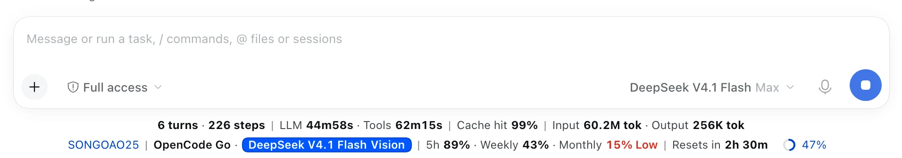

## What it shows

| Group | Fields |
|---|---|
| Provider | the exact provider and model, mirroring DSH's model switcher |
| Native stats (kept) | turns and steps, model time, tool time, cache hit rate, input/output tokens, context usage |
| Money | real balance, subscription quota windows, or this month's cloud bill |
| Pricing | peak and off-peak prices, the current period, a countdown to the next price change |
| Spend | this session (including subagents), today, last 30 days, all time |
| Extras | main time, world time, custom text |

The bar has two densities — click it to switch. **Compact** shows only the provider, model, and one essential account detail: balance, the shortest useful quota window, or this billing period's spend. **Full** shows every enabled detail, including DSH's native stats row. Both follow DSH's light or dark theme.

## Compact mode

Four real states — light and dark, balance and subscription quota.

**Light · balance**

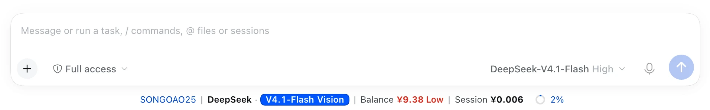

**Dark · balance**

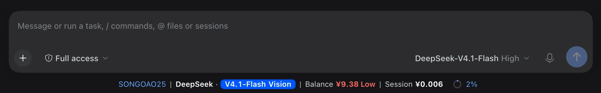

**Light · subscription quota**

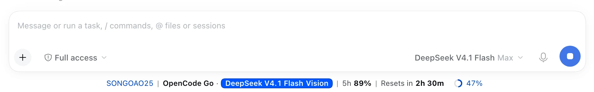

**Dark · subscription quota**

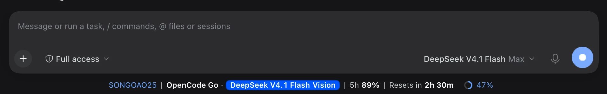

## Three billing modes

The bar follows the active session and picks the mode from the provider. The three modes are mutually exclusive — there is no manual switch.

### Balance

Shows the real balance from the provider's own API. It refetches when the bar opens, the page refreshes or the provider changes, then polls every 60 seconds; a failed refresh keeps the last known figure on screen. Below 20 (in the account's currency) the amount and a **Low** label turn red.

### Subscription quota

Full mode shows each available quota window (5-hour / weekly / monthly) and a countdown to the next reset — both always come from the same window, so they can never disagree. Windows show **remaining** percent by default and can be switched to **used** in settings; the low-quota warning always follows the remaining ≤ 20% rule. Compact mode keeps only the shortest available window (5-hour → weekly → monthly), without a reset countdown.

### Cloud billing

Shows this month's real spend from the provider's official billing API, for example `Together | This month $12.34` or `AWS Bedrock | This month $45.60 · Budget 46%`. Cloudflare also shows the daily free-quota remainder with a UTC-midnight reset countdown when the API actually reports a free allowance.

## Install

Requires DeepSeek Harness with the web interface (`dsh web`) and pnpm.

**From npm** (recommended — installs the released version):

```bash
dsh plugin --profile web add dsh-bottom-info-bar
```

**From the GitHub repository** — [github.com/songoao25/dsh-bottom-info-bar](https://github.com/songoao25/dsh-bottom-info-bar) (tracks the default branch; `lib/` is committed, so no build runs on install):

```bash
dsh plugin --profile web add https://github.com/songoao25/dsh-bottom-info-bar
```

**With the local one-click script** (clone, build and install in one step):

```bash
git clone https://github.com/songoao25/dsh-bottom-info-bar.git
cd dsh-bottom-info-bar
./install.sh
```

If you installed from a checkout before the package moved to the repository root, your profile points at `<repo>/plugin`. That path still resolves — the repository keeps `plugin/` as symlinks to the package root — so nothing needs reinstalling. If it does not resolve (a ZIP download, for instance, delivers those symlinks as plain files), remove the plugin and install again with one of the commands above.

Then **restart `dsh web`** — plugins are composed when the host starts, so a page refresh is not enough. The plugin shows up in the Plugins list, enabled:

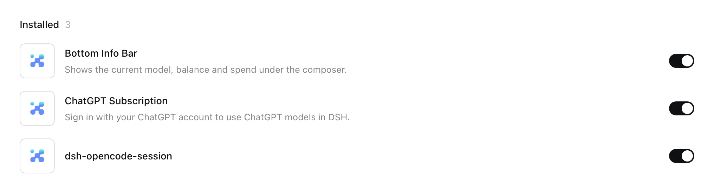

More detail and troubleshooting: [docs/INSTALL.md](docs/INSTALL.md).

## Settings

Everything lives on the plugin page — **Plugins → bottom-info-bar**. Changes save as you make them.

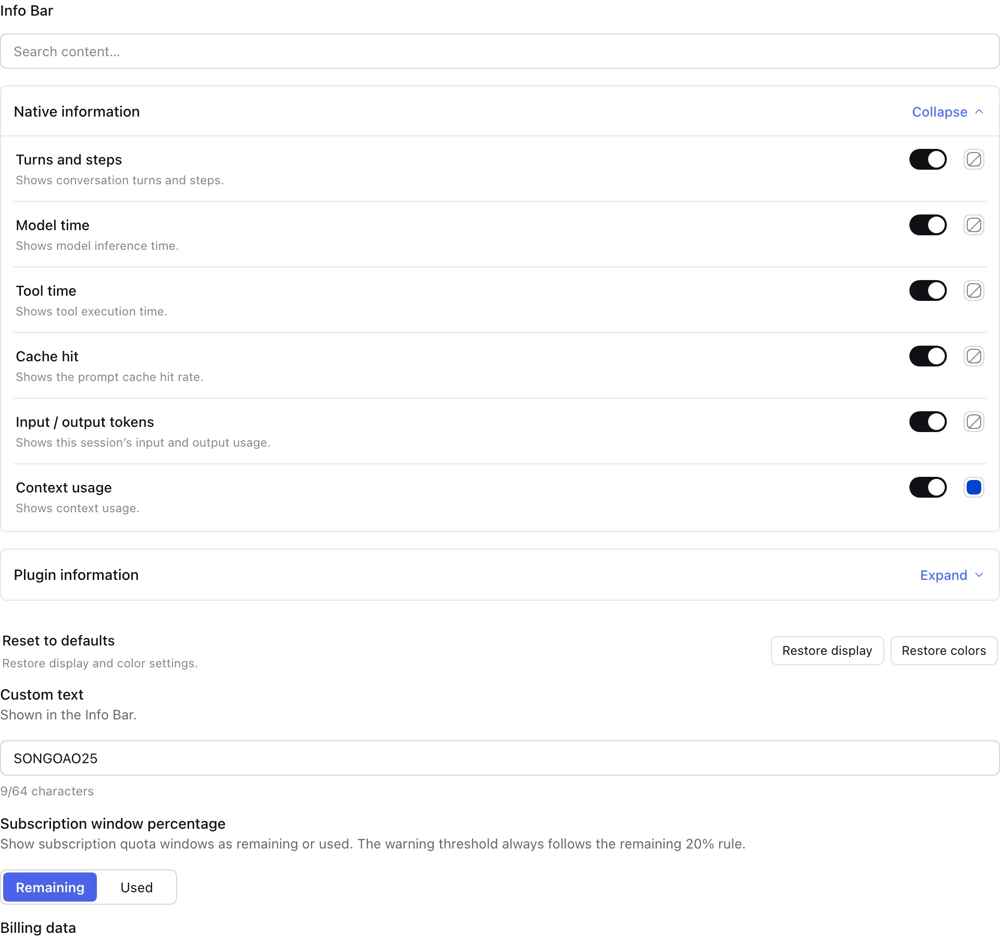

**Information display** — choose **Compact** or **Full** and the choice is saved. Compact does not erase any field choices; switch back to Full whenever you need the extra detail.

**Fields and colors** — one switch and one color per field, in two groups. Turn a field off and the bar drops it. The plugin information group opens first; native stats only appear in Full mode.

- **Native information** — the fields DSH's own stats row already showed.
- **Plugin information** — everything this bar adds: provider and model, subscriptions, spend, balance, pricing and quota.

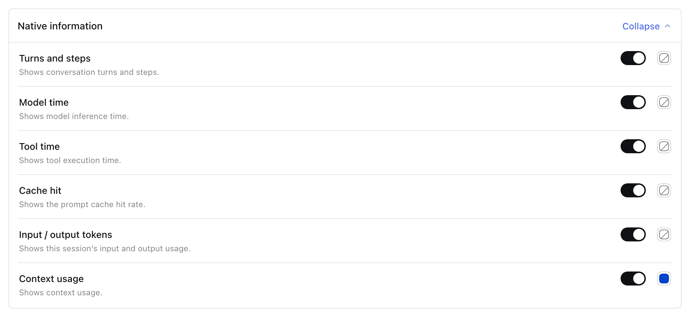
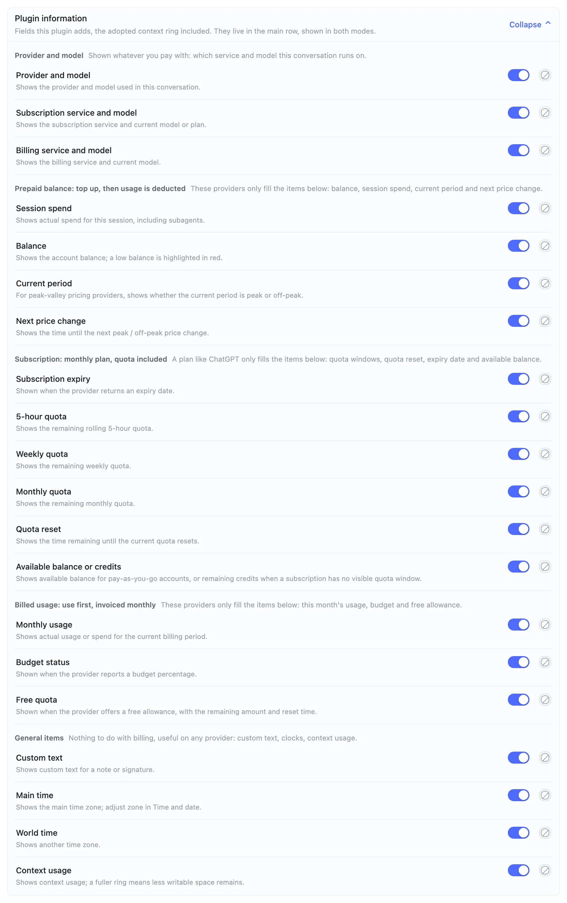

**Subscription window percentage** — show quota windows as **remaining** (default) or **used**. The low-quota warning always follows remaining ≤ 20%.

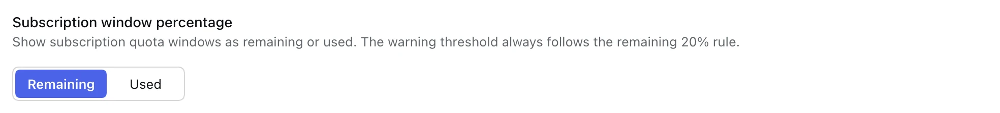
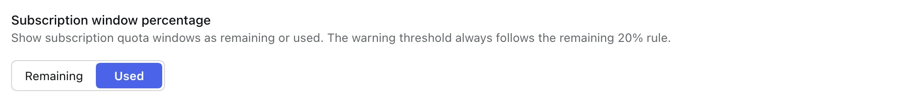

**Time and date** — main and world time zones, plus which of year / month / day / hour / minute / second to display.

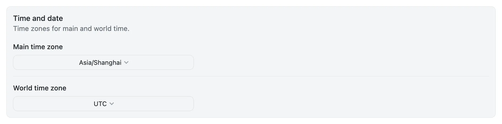

**Custom text** — up to 64 characters, shown in the bar.

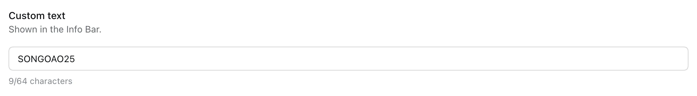

**Billing data** — export the ledger as CSV or JSON, or clear it after confirmation. Settings and sign-in information stay untouched.

## Supported providers

The bar detects the provider from DSH's current model — no configuration. Set the key in DSH under **Settings → Models**.

### Balance

| Provider | Display name | Credential / source |
|---|---|---|
| deepseek / deepseek-official | DeepSeek | `DEEPSEEK_API_KEY` |
| openai | OpenAI | `OPENAI_API_KEY` — estimated from your spending rate; there is no public balance API |
| moonshotai / moonshotai-cn / kimi-coding | Kimi | `MOONSHOT_API_KEY` |
| openrouter | OpenRouter | `OPENROUTER_API_KEY` |
| stepfun | StepFun | `STEPFUN_API_KEY` |
| xiaomi | Xiaomi MiMo | `XIAOMI_API_KEY` |

### Subscription quota

| Provider | Display name | Credential / source |
|---|---|---|
| codex / chatgpt / openai-codex | ChatGPT / Codex | `~/.codex/auth.json` (read-only, decoded locally) |
| opencode-go / opencode | OpenCode Go | `OPENCODE_GO_API_KEY` or the opencode CLI login |
| zai / zai-coding-cn | Zhipu | `ZAI_CODING_CN_API_KEY` (fallback `ZAI_API_KEY`) |
| xiaomi-token-plan-cn / -sgp / -ams | Xiaomi MiMo | `XIAOMI_TOKEN_PLAN_CN/SGP/AMS_API_KEY` (fallback `XIAOMI_API_KEY`) |
| command / command-code | Command Code | `COMMAND_CODE_API_KEY` or `CMD_API_KEY`, or `~/.commandcode/auth.json` |
| minimax / minimax-cn | MiniMax | `MINIMAX_API_KEY` (Global) / `MINIMAX_CN_API_KEY` (CN) — must be a **Subscription Key** |

### Cloud billing

| Provider | Display name | Credential / source |
|---|---|---|
| together | Together | `TOGETHER_API_KEY` — official Usage API, this month's spend |
| fireworks | Fireworks | `FIREWORKS_API_KEY` — official Billing API, this period's spend |
| amazon-bedrock | AWS Bedrock | `AWS_ACCESS_KEY_ID` / `AWS_SECRET_ACCESS_KEY` — Cost Explorer + Budgets |
| cloudflare-ai-gateway / cloudflare-workers-ai | Cloudflare | `CLOUDFLARE_API_KEY` + `CLOUDFLARE_ACCOUNT_ID` (token needs Billing read) |

Anything else shows a **Not supported** hint instead of borrowing another provider's numbers.

## Spend tracking

Every model response is recorded (usage × unit price) and aggregated four ways: **this session** (including subagents), **today**, **last 30 days** and **all time**. The price is locked the moment a response completes, so later price-table updates never rewrite history. A model with no known price keeps its token counts but is excluded from money totals — no amount is ever invented. Records are written to disk before they count, so a restart loses nothing; if a write fails, the bar says **Spend not saved**.

## Updating

The plugin checks npm for a newer version at startup and re-checks at most every 15 minutes. When one exists, a red **Update available** label appears in the bar: click it to copy the update command, run it in a terminal, then restart `dsh web`.

| Installed via | Command |
|---|---|
| npm | `dsh plugin --profile <profile> add dsh-bottom-info-bar@latest` |
| GitHub address | `dsh plugin --profile <profile> add <the same address>` |
| local checkout or install script | `git -C <repo> fetch origin && git -C <repo> checkout main && git -C <repo> merge --ff-only origin/main && node <repo>/scripts/build.mjs` |

Nothing updates by itself — the bar only tells you that a newer version exists.

## Privacy and security

- **Read-only credentials.** API keys stay in DSH; `~/.codex/auth.json` and `~/.commandcode/auth.json` are read locally and never written back. This plugin does not bind or refresh accounts.
- **No conversation content.** The ledger stores tokens, model, provider, currency and cost — never prompts, messages or keys.
- **Local only.** Data lives in `~/.dsh/dsh-bottom-info-bar/` (directory `0700`, files `0600`). Nothing leaves your machine except the provider API requests the bar itself makes.
- **Uninstalling keeps your data.** Export or clear it from the plugin page (Billing data) if you want a clean slate.

## Development

- Build: `npm run build`
- Test: `node tests/run-all.mjs`
- Contributing: [CONTRIBUTING.md](CONTRIBUTING.md)

## License

[MIT](LICENSE) © 2026 songoao25

💬 Questions or ideas? Join our WeChat group **DeepThinking** — [QR code](assets/wechat-group.png).
