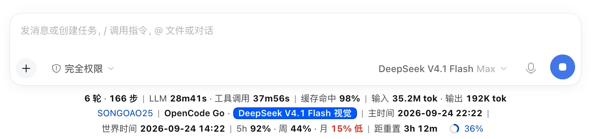
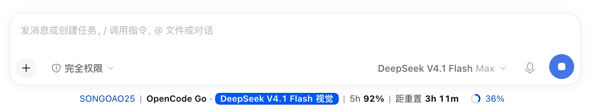
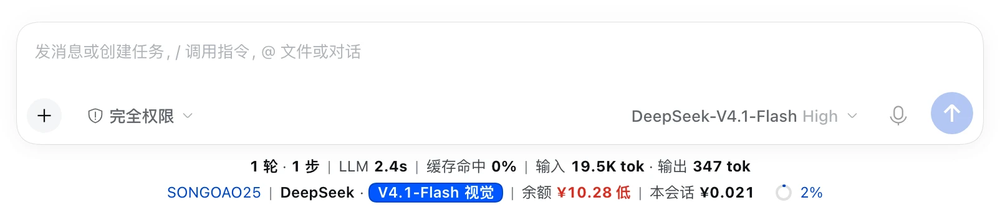
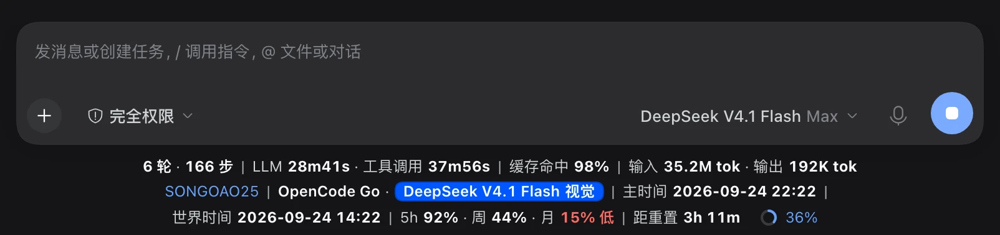
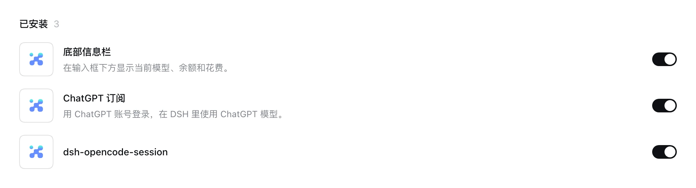
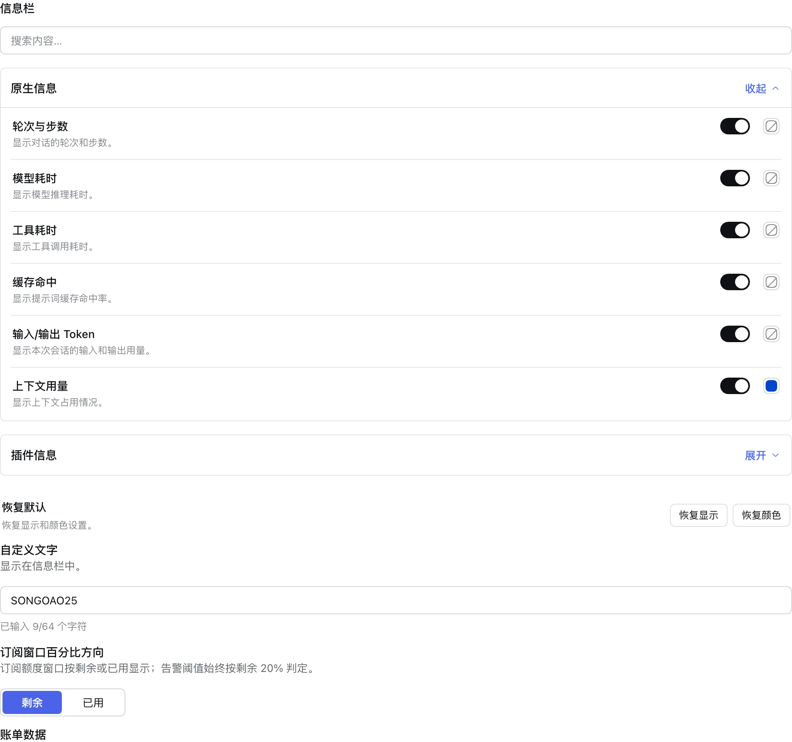
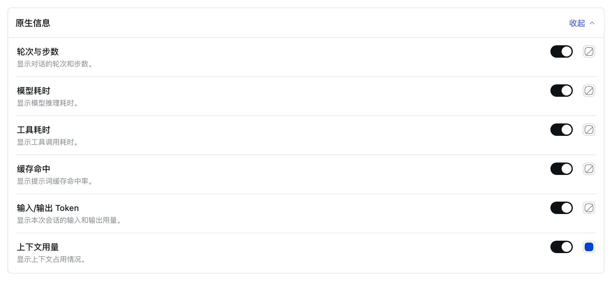
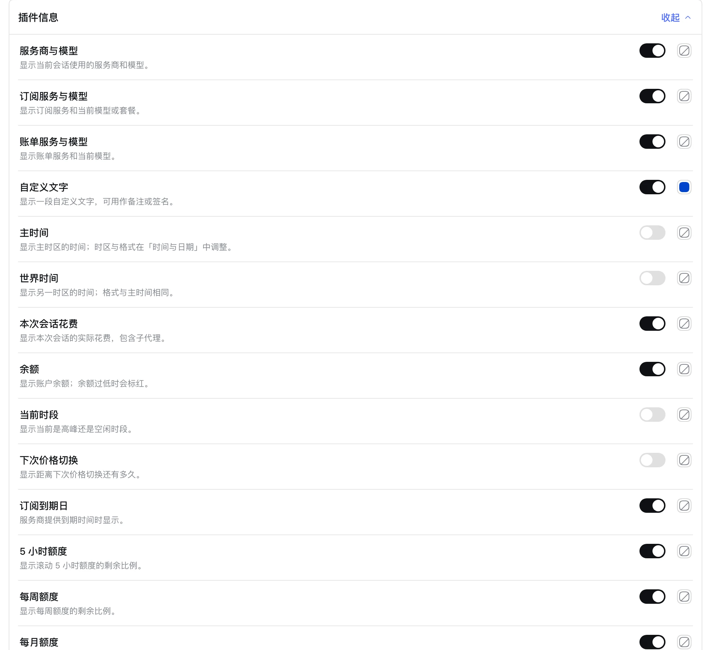
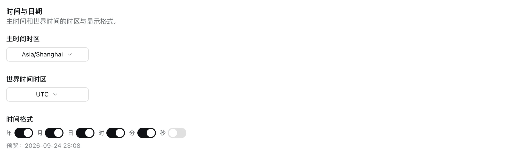

# 底部信息栏

[**English**](README.md) | **中文**

[](https://www.npmjs.com/package/dsh-bottom-info-bar)
[](https://github.com/songoao25/dsh-bottom-info-bar/blob/main/LICENSE)

DeepSeek Harness 插件：把输入框下方那行统计栏换成一行信息栏——服务商与模型、真实余额或订阅额度、高峰/空闲定价，以及本会话已经花了多少。



## 它显示什么

| 分组 | 内容 |
|---|---|
| 服务商 | 当前会话的服务商与具体模型，跟随 DSH 模型切换器 |
| 原生统计（保留） | 轮次与步数、模型耗时、工具耗时、缓存命中率、输入/输出 token、上下文占用 |
| 金额 | 真实余额、订阅额度窗口，或本月云账单 |
| 定价 | 高峰价与空闲价、当前时段、下次价格切换倒计时 |
| 花费 | 本会话（含子代理）、今天、近 30 天、累计 |
| 其它 | 主时间、世界时间、自定义文字 |

点击信息栏可在**完整**与**简洁**之间切换；配色跟随 DSH 的深色或浅色主题。



## 三种计费模式

信息栏跟随当前会话，按服务商自动选择模式。三种模式互斥，无需手动切换。

### 余额制

显示服务商官方接口返回的真实余额。信息栏打开、页面刷新或切换服务商时立即重查，之后每 60 秒轮询一次；刷新失败时保留上一次的数值。余额低于 20（按账户币种）时，金额与**低**标记转红。



### 订阅额度制

显示各窗口剩余额度（5 小时 / 周 / 月）与距下次重置的倒计时——两者始终取自同一个窗口，不会互相矛盾。窗口默认按**剩余**显示百分比，可在设置里切换为**已用**；低额度告警始终按剩余 ≤ 20% 判定。简洁模式优先显示时长最短的可用窗口（5 小时 → 周 → 月）。

### 云账单制

显示官方账单接口返回的本月真实花费，例如 `Together | 本月 $12.34`、`AWS Bedrock | 本月 $45.60 · 预算 46%`。Cloudflare 还会在接口确实返回免费额度时，显示每日免费额度剩余与 UTC 零点重置倒计时。

## 深色模式

配色跟随 DSH 主题，无需单独设置。



## 安装

需要带 Web 界面的 DeepSeek Harness（`dsh web`）与 pnpm。

**npm 安装**（推荐，装的是已发布版本）：

```bash
dsh plugin --profile web add dsh-bottom-info-bar
```

**从 GitHub 仓库安装** —— [github.com/songoao25/dsh-bottom-info-bar](https://github.com/songoao25/dsh-bottom-info-bar)（跟随默认分支；`lib/` 已入库，安装时不跑构建）：

```bash
dsh plugin --profile web add https://github.com/songoao25/dsh-bottom-info-bar
```

**本地一键脚本**（clone、构建、安装一步完成）：

```bash
git clone https://github.com/songoao25/dsh-bottom-info-bar.git
cd dsh-bottom-info-bar
./install.sh
```

如果你在「包移到仓库根」之前用本地代码装过，profile 里的路径末尾是 `/plugin`。这条路径依然有效——仓库里保留了 `plugin/` 软链指向仓库根，所以不必重装。万一它不生效（例如用 ZIP 下载仓库时，软链会变成普通文件），先卸载，再用上面的任一方式装一次。

然后**重启 `dsh web`** —— 插件在宿主启动时组合，刷新页面不够。重启后插件出现在插件列表并处于启用状态：



详细步骤与故障排查见 [docs/INSTALL.md](docs/INSTALL.md)。

## 设置

配置都在插件页（**插件 → bottom-info-bar**），改完自动保存。



**字段与配色** —— 每个字段一个开关、一个颜色，分两组。关掉哪个字段，信息栏就不再显示它。

- **原生信息** —— DSH 原生统计栏本来就有的字段。
- **插件信息** —— 信息栏新增的全部内容：服务商与模型、订阅、花费、余额、定价与额度。




**订阅窗口百分比方向** —— 按**剩余**（默认）或**已用**显示额度窗口。低额度告警始终按剩余 ≤ 20% 判定。


**时间与日期** —— 主时间与世界时间的时区，以及年 / 月 / 日 / 时 / 分 / 秒的显示格式。



**自定义文字** —— 最多 64 个字符，显示在信息栏中。


**账单数据** —— 导出 CSV / JSON，或确认后清除记录。设置与登录信息不受影响。

## 支持的服务商

信息栏从 DSH 当前模型识别服务商，零配置；密钥在 DSH 的**设置 → 模型**里填写。

### 余额制

| 服务商 | 显示名 | 凭据 / 数据来源 |
|---|---|---|
| deepseek / deepseek-official | DeepSeek | `DEEPSEEK_API_KEY` |
| openai | OpenAI | `OPENAI_API_KEY` —— 按消耗速度估算；官方没有公开余额接口 |
| moonshotai / moonshotai-cn / kimi-coding | Kimi | `MOONSHOT_API_KEY`（回退 `KIMI_API_KEY`） |
| openrouter | OpenRouter | `OPENROUTER_API_KEY` |
| stepfun | StepFun | `STEPFUN_API_KEY` |
| xiaomi | 小米 MiMo | `XIAOMI_API_KEY` |

### 订阅额度制

| 服务商 | 显示名 | 凭据 / 数据来源 |
|---|---|---|
| codex / chatgpt / openai-codex | ChatGPT / Codex | `~/.codex/auth.json`（只读，本机解析） |
| opencode-go / opencode | OpenCode Go | `OPENCODE_GO_API_KEY` 或 opencode CLI 登录 |
| zai / zai-coding-cn | 智谱 | `ZAI_CODING_CN_API_KEY`（回退 `ZAI_API_KEY`） |
| xiaomi-token-plan-cn / -sgp / -ams | 小米 MiMo | `XIAOMI_TOKEN_PLAN_CN/SGP/AMS_API_KEY`（回退 `XIAOMI_API_KEY`） |
| command / command-code | Command Code | `COMMAND_CODE_API_KEY` 或 `CMD_API_KEY`，或 `~/.commandcode/auth.json` |
| minimax / minimax-cn | MiniMax | `MINIMAX_API_KEY`（Global）/ `MINIMAX_CN_API_KEY`（国内）—— 必须是 **Subscription Key** |

### 云账单制

| 服务商 | 显示名 | 凭据 / 数据来源 |
|---|---|---|
| together | Together | `TOGETHER_API_KEY` —— 官方 Usage API，本月花费 |
| fireworks | Fireworks | `FIREWORKS_API_KEY` —— 官方 Billing API，本周期花费 |
| amazon-bedrock | AWS Bedrock | `AWS_ACCESS_KEY_ID` / `AWS_SECRET_ACCESS_KEY` —— Cost Explorer + Budgets |
| cloudflare-ai-gateway / cloudflare-workers-ai | Cloudflare | `CLOUDFLARE_API_KEY` + `CLOUDFLARE_ACCOUNT_ID`（令牌需 Billing 读权限） |

不在列表中的服务商显示**未适配**提示，绝不借用别的服务商的数据。

## 花费记账

每次模型响应都会记录一条（用量 × 单价），并按四个口径聚合：**本会话**（含子代理）、**今天**、**近 30 天**、**累计**。单价在响应完成的那一刻锁定，之后的价目表更新不会改写历史金额。价目表里没有的模型保留 token 用量但不计入金额，绝不编造金额。记录先落盘再计入，重启不丢；写入失败时信息栏显示**账单未保存**。

## 更新

插件在一次完整的 DSH 启动后检查一次 npm 上的新版本。有新版时，信息栏出现红色**新版本提醒**标签：点击即可复制更新命令，到终端执行后重启 `dsh web`。

| 安装方式 | 命令 |
|---|---|
| npm | `dsh plugin --profile <profile> add dsh-bottom-info-bar@latest` |
| GitHub 地址 | `dsh plugin --profile <profile> add <同一个地址>` |
| 本地代码或一键脚本 | `git -C <仓库> fetch origin && git -C <仓库> checkout main && git -C <仓库> merge --ff-only origin/main && node <仓库>/scripts/build.mjs` |

插件绝不自动更新——它只负责告诉你「有新版本」。

## 隐私与安全

- **只读凭据。** API Key 始终留在 DSH 里；`~/.codex/auth.json` 与 `~/.commandcode/auth.json` 只在本机读取，绝不写回。本插件不负责绑定或续期账号。
- **不保存对话内容。** 账本只记录 token、模型、服务商、币种与花费——没有提示词、消息或密钥。
- **只存本地。** 数据在 `~/.dsh/dsh-bottom-info-bar/`（目录 `0700`、文件 `0600`）。除了信息栏自身发起的服务商接口请求，没有任何数据离开本机。
- **卸载不删数据。** 想彻底清零，在插件页的「账单数据」里导出或清除。

## 开发

- 构建：`npm run build`
- 测试：`node tests/run-all.mjs`
- 贡献：[CONTRIBUTING.md](CONTRIBUTING.md)

## 许可证

[MIT](LICENSE) © 2026 songoao25

💬 有问题或想法？扫码加入微信群 **DeepThinking**：


